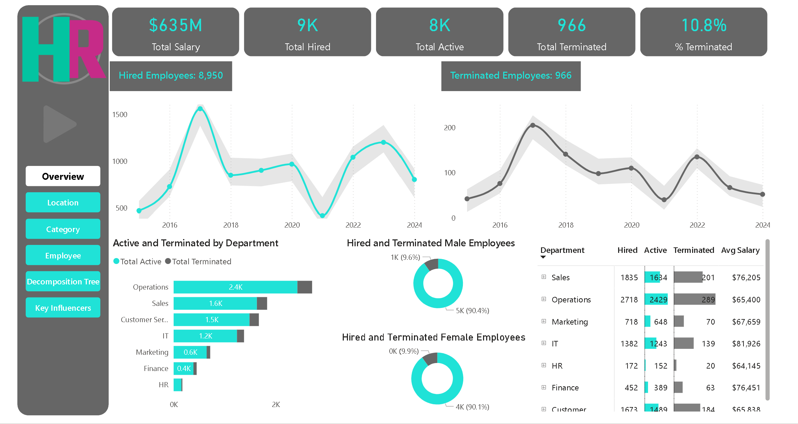
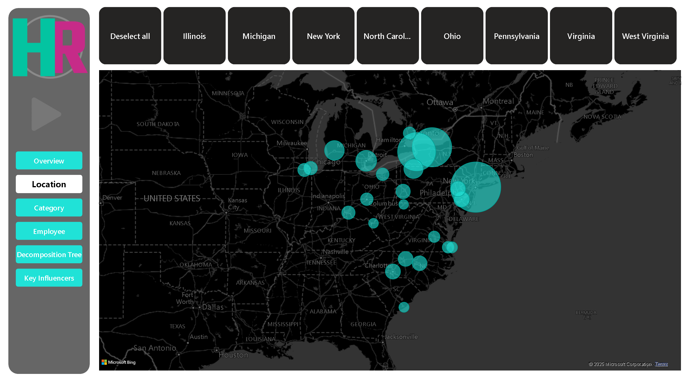
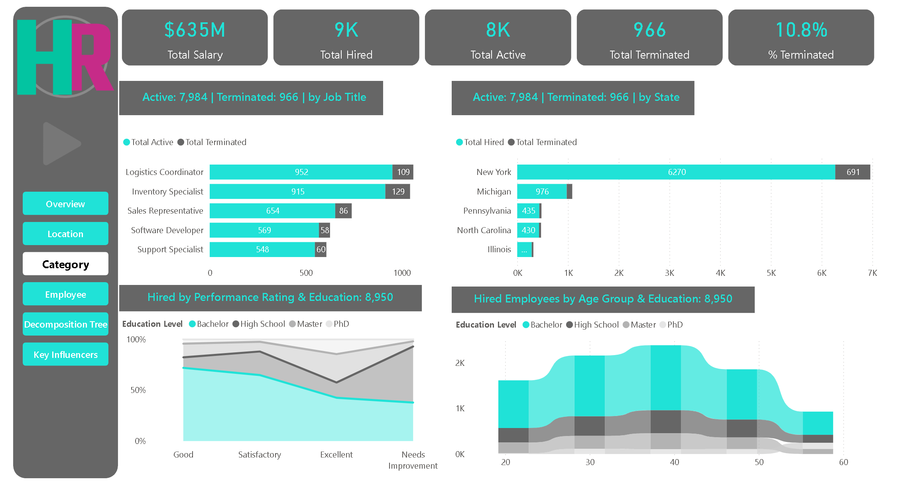
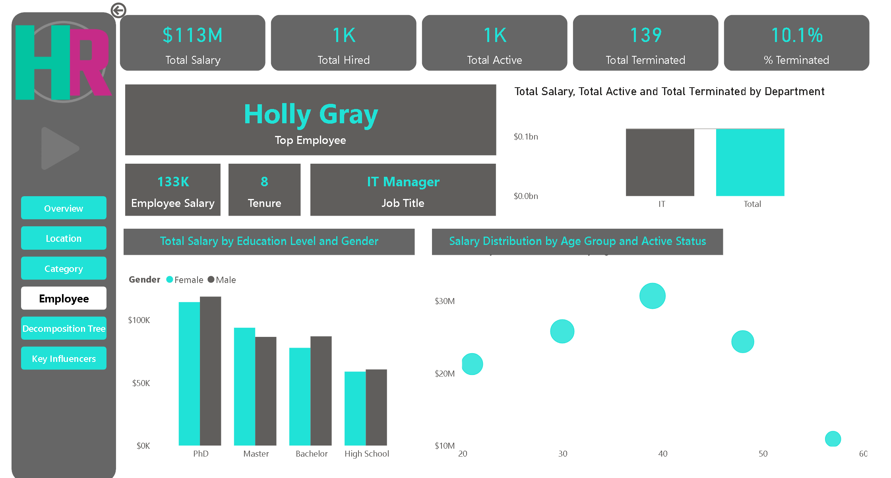
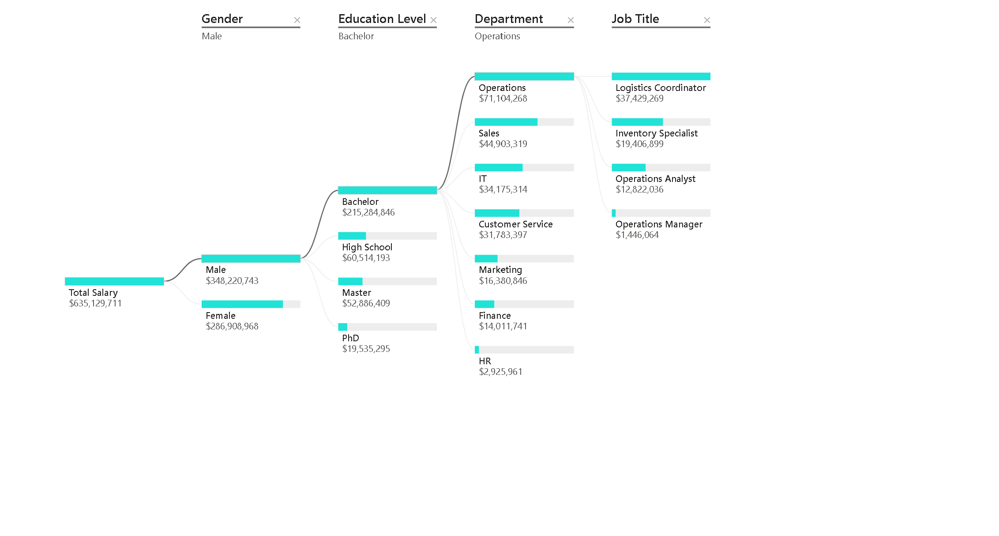
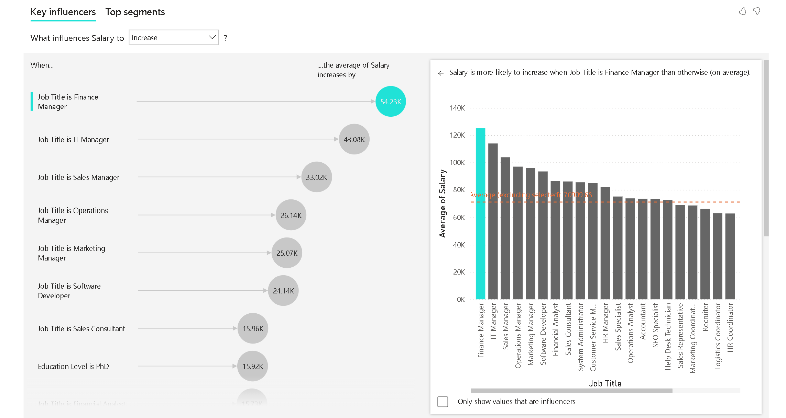
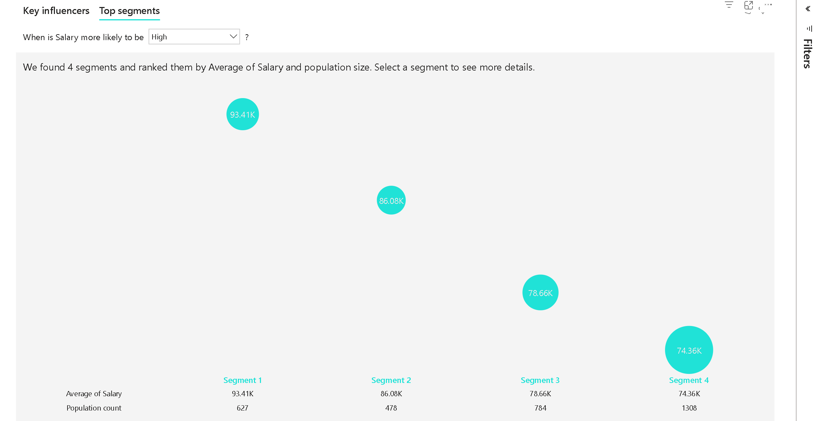

# 🧠 HR Analytics Dashboard (Power BI)

Welcome to my **HR Analytics Dashboard** project built using **Microsoft Power BI**. This interactive dashboard provides end-to-end HR insights including employee hiring, termination, salary breakdown, location analysis, and influential factors driving workforce trends.

---

## 📌 Project Overview

- 📈 **Total Salary Analyzed**: $635M  
- 👥 **Employees Hired**: 9,000  
- ✅ **Active Employees**: 8,000  
- ❌ **Terminated Employees**: 966  
- 📉 **Attrition Rate**: 10.8%

This dashboard helps HR managers, analysts, and decision-makers explore workforce patterns, compare salaries, understand performance vs. education, and spot top contributing roles.

---

## 🎯 Key Dashboard Pages

### 1. Overview
Tracks total hires, active vs. terminated, and salary spend over time. Displays department-level insights and gender distribution.  

### 2. Location
Geographical distribution of employees across the U.S.  

### 3. Category
Detailed breakdown by job title, education level, and employment status.  

### 4. Employee Details
Individual employee insights, showing tenure, job title, gender, and salary information.  

### 5. Decomposition Tree
AI visual that breaks down salary by gender → education → department → job title.  

### 6. Key Influencers
Identifies the key factors influencing salary — such as job role, education level, and gender.  

### 7. Top Segments
Displays salary distribution across top-performing employee groups.  

---

## 🛠 Tools Used

- **Microsoft Power BI**
- **DAX (Data Analysis Expressions)**
- **Power BI AI Visuals** (Key Influencers, Decomposition Tree)
- **Data Modeling and Relationship Building**

---

## 🔍 Insights Uncovered

- **Operations** has the highest headcount and salary allocation.
- **Finance Managers** have the most significant positive impact on salary (~+$54K).
- **New York** leads in employee concentration across the U.S.
- **Bachelor’s degree holders aged 30–40** dominate the workforce.
- Standout employee: *Holly Gray* – IT Manager with 8 years tenure and $133K salary.

---

## 🤝 Connect With Me

- 💼 **LinkedIn:** [Sumit Chhillar](https://www.linkedin.com/in/sumit-chhillar-020a36323/)  
- 🔗 **GitHub Repository:** [HR Analytics Dashboard](https://github.com/Sumit170694/HR-Analysis-PBi)

If you found this project helpful or inspiring, feel free to ⭐ star the repo, fork it, or reach out!

---

